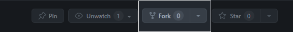
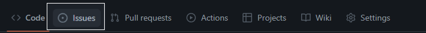
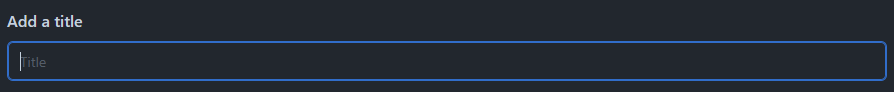
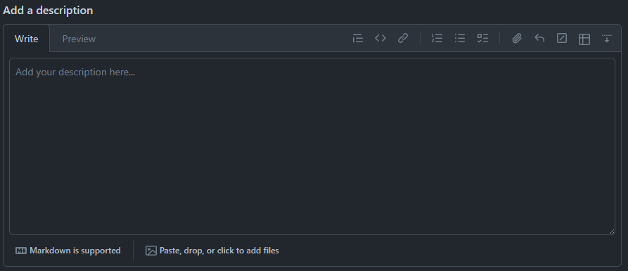
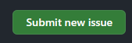

<a name="readme-top"/>

 

 

  

  <h3 align="center">Github - Git & Readme Guides</h3>

 

---

 
 

  
Table of Contents

  <ol>
    <li>
      <a href="#project-overview">Project Overview</a>
    </li>
    <li>
      <a href="#git-guides">Git Guides</a>
    </li>
    <li>
      <a href="#readme-collection">Readme Collection</a>
      <ol>
        <li>
          <a href="#readme-project-sample">Readme Project Sample</a>
        </li>
        <li>
          <a href="#readme-design-and-tools-collection">Readme Design and Tools Collection</a>
        </li>
      </ol>
    </li>
    <li>
      <a href="#contributors">Contributors</a>
    </li>
    <li>
      <a href="#how-to-contribute">How to Contribute</a>
      <ol>
        <li>
          <a href="#forking">Fork Repository</a>
        </li>
        <li>
          <a href="#report-an-issue">Report an Issue</a>
        </li>
        <li>
          <a href="#giving-a-star">Give a Star</a>
        </li>
      </ol>
    </li>
  </ol>

---

## Project Overview

This project serves as a comprehensive reference guide for utilizing GitHub and creating effective README documentation. It includes a collection of solutions and workarounds for common issues encountered on GitHub, making it a valuable resource for beginners.

Contributors to the project have identified and addressed a variety of challenges, offering guidance and support to newcomers navigating GitHub and README best practices. The project also features examples of potential README designs, statistical insights, and useful GitHub commands.

We encourage you to participate by making requests, reporting issues, sharing your expertise, and collaborating with us to enhance this resource. Let’s work together to create a supportive community for GitHub users of all levels.

 

(<a href="#readme-top">back to top</a>)

---

## Git Guides

The Git Guides section is organized into a collection of markdown files within the project's directory at **[./git/settingup-git-windows.md](https://github.com/zyx-0314/Github-Git-Guide/blob/main/git/settingup-git-windows.md)** for windows and **[./git/settingup-git-mac.md](https://github.com/zyx-0314/Github-Git-Guide/blob/main/git/settingup-git-mac.md)** for mac. This comprehensive guide covers a variety of essential Git information and workflows, including:

- Installation of Git with VS Code Windows & Mac*
  - Useful extensions for Pull Request, Issues, Cloning and Publishing
- External Git Guides:
  - [Deploying Simple Website](https://scribehow.com/shared/Deploy_a_website_using_GitHub_Pages__UyFSCsflSte7l0IhcvFFdg?referrer=workspace)
  - [Using Template Repository for Projects](https://scribehow.com/shared/Create_Repository_Based_on_Template_on_GitHub__uqrFu1o3T3iETD9bBMGFlQ?referrer=workspace)
- Problems in [Github and VS Code](https://github.com/zyx-0314/Github-Git-Guide/blob/main/git/problems.md)
- Best Practices in Git Commit Messages [Commits](https://github.com/zyx-0314/Github-Git-Guide/blob/main/git/commit.md)

*(Still in works)

 

(<a href="#readme-top">back to top</a>)

---

## Readme Collection

The Readme Collection is a repository curated by FEU IT students. It serves as a compendium of instructions, components, and discovered APIs suitable for integration into readme files.

---

### Readme Project Sample

The following are the list of Accounts where Readme can be found;
|User|Type|Link|
|

Legends:
- Minimalist
- Anime
- Futuristic

 

---

### Readme Design and Tools Collection

The following are the list of Readme Designs.

Each Technology has insturuction and sample on how to use.

| Design Name | Link | Remark | Instructions |
|-|-|-|-|
| Waka Time | [WakaTime](https://wakatime.com/) | used to keep track of activity time in projects, ide, os and langugae | wakatime.md |
| Daily Dev Card | [daily.dev](https://daily.dev/) | creation of dev card profile | [Scribe Instructions](https://scribehow.com/shared/Create_Dailydev_Devcard_in_Horizontal_Layout_with_Code_copied__DGmdmjIuQGGu7H0J1ofThg?referrer=workspace) |
| 3D Github Contributions | [OpenTTD/isometric](https://github.com/OpenTTD/OpenTTD) | for more dramatic 3d representation of github contribution chart | [Just Install This](https://chromewebstore.google.com/detail/github-isometric-contribu/mjoedlfflcchnleknnceiplgaeoegien) |
| Technology Badges | [Readme Badges](https://github.com/alexandresanlim/Badges4-README.md-Profile) | use badges to design your read with the technologies you know or your using. Instead of just text why not add some badges | soon... |

 

(<a href="#readme-top">back to top</a>)

---

## Contributors

 

(<a href="#readme-top">back to top</a>)

---

## How To Contribute

You can contribute by Forking and Doing a Pull Request, reporting an issue/s or giving us star.

### Forking
You can make your own copy of the project by Forking the project.

You can contribute by doing Pull Request after you modify the project. 

 
 

### Report an Issue
If you encounter any issues or bugs, please create an issue on the GitHub repository.

Steps:

1. Find the Issue Tab

2. Find the New Issue Button

4. Add a Short Title

6. Add Descriptions

Format of Description
   i.   Problem - Describe the problem
   ii.  Step-by-Step of how the problem occur, if possible with screen-shots
   iii. if there is variables, include at the bottom

---

Format sample:

The problem is something like this and it does this but should do this, im using mac laptop and i use this kind of ide.

Step-by-Step:
Step 1: Open the terminal

Step 2: Choose option 2

Step 3: Enter Values

Step 4: Problem Occur here that should be something like this but it does this.

Variables:
the values I placed are;
1 - for registration
2 - Dela Cruz for Last name

---

7. Submit

 
 

### Giving a Star
If you find this project interesting, consider giving it a star on GitHub. You can also follow the repository for updates and notifications.

 

(<a href="#readme-top">back to top</a>)

